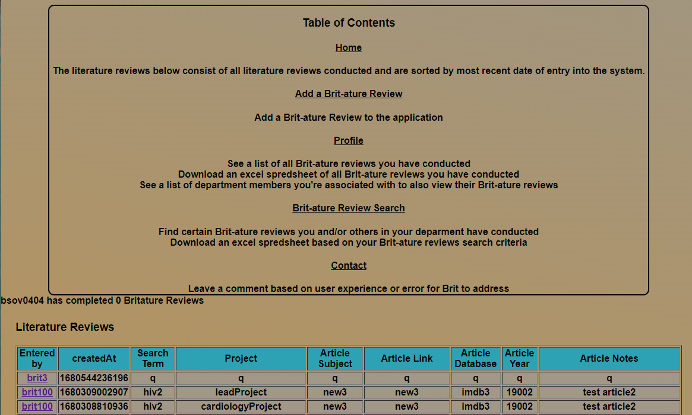
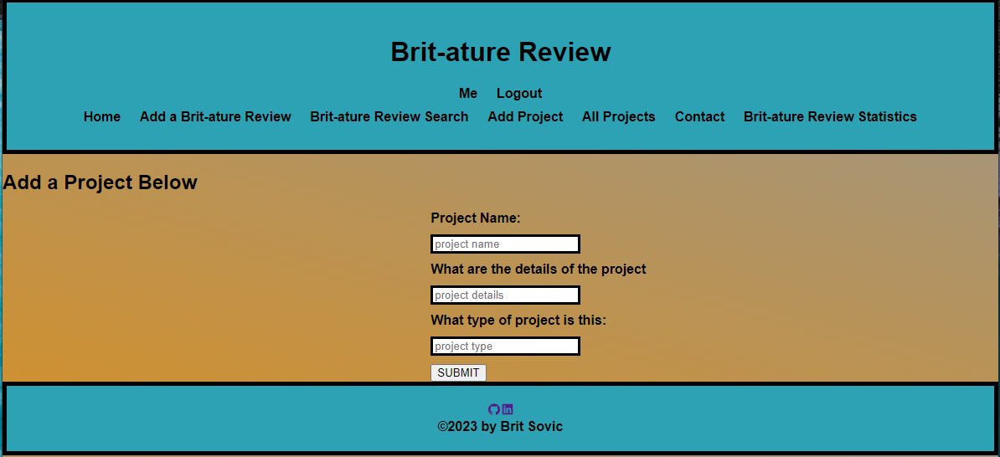

# literature-review

## Table of Contents

[Project-Description](#project-description)

[Tools-Used](#tools-used)

[Deployed-Application](#deployed-application)

[Future-Developments](#future-developments)

[Application-Screenshots](#application-screenshots)

## Project Description

As a Researcher, conducting literature review for a paper consists of creating an Excel document and copying and pasting links, info, 
terms, and other information to the excel sheet in an unformatted top to bottom of the sheet. The only way to then look through and 
figure out where certain links may be is scrolling via certain columns and/or ctrl + f.

I designed this application to allow a user to easily save literature review information via an application form.

The application then allows the user to easily find and/or search their recent saves and export an excel sheet of literature reviews they conducted for any purpose based on search terms, site, information.

## Tools Used

* React.js
* MongoDb
* Graphql
* CSS
* bcrypt
* jsonwebtoken

## Deployed Application

The deployed application can be found at:

## Future Developments

* I would like to make the add-lit-review page in a way that allows the user to self-design their own tabs

* I would like to update the stats page with in-depth stats, graphs, and a dashboard customizable to the user

## Application Screenshots

